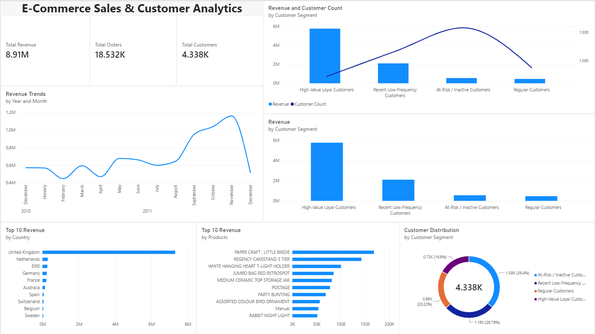
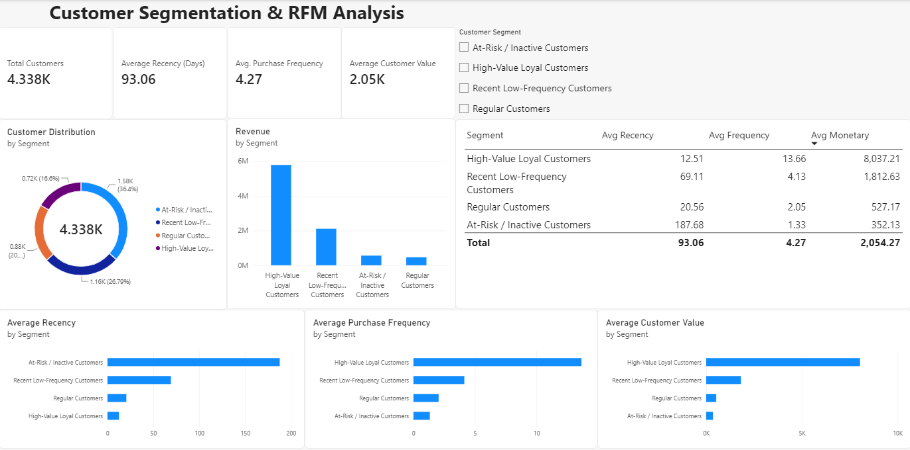
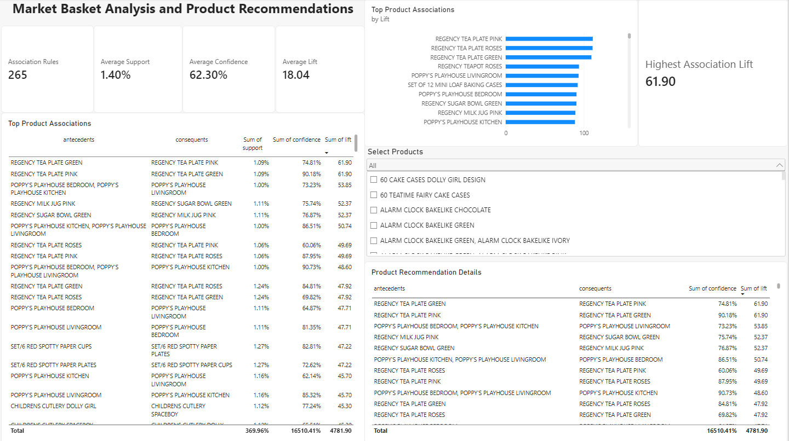

# E-Commerce Customer Segmentation & Market Basket Analysis

An end-to-end data analytics and machine learning project that combines SQL, Python, customer segmentation, market basket analysis, and Power BI to extract actionable insights from e-commerce transaction data.

---

## Project Overview

This project analyzes the UCI Online Retail dataset to understand customer purchasing behavior, segment customers based on their buying patterns, and identify product associations for recommendation opportunities.

The project integrates:

- **MySQL** for data storage, cleaning, and SQL analysis
- **Python** for data preprocessing and machine learning
- **RFM Analysis** for customer behavior analysis
- **K-Means Clustering** for customer segmentation
- **FP-Growth** for market basket analysis
- **Association Rules** for product recommendations
- **Power BI** for interactive business dashboards

The complete workflow transforms raw transaction data into customer segments, product associations, and business insights.

---

## Project Objectives

1. Clean and preprocess raw e-commerce transaction data.
2. Analyze sales, customers, products, and countries using SQL.
3. Engineer RFM features for customer segmentation.
4. Apply K-Means clustering to identify customer groups.
5. Discover frequently purchased product combinations.
6. Generate association rules for product recommendations.
7. Build an interactive Power BI dashboard.
8. Present actionable insights for customer retention and cross-selling.

---

## Project Architecture

```text
UCI Online Retail Dataset
          |
          v
      MySQL Database
          |
          v
  Data Cleaning and SQL Analysis
          |
          +------------------------+
          |                        |
          v                        v
   RFM Feature Engineering   Transaction Preparation
          |                        |
          v                        v
   K-Means Clustering       FP-Growth Algorithm
          |                        |
          v                        v
 Customer Segmentation     Association Rules
          |                        |
          +-----------+------------+
                      |
                      v
                Power BI
                      |
                      v
          Interactive Business Dashboard
```

---

## Dataset Info

| Attribute | Details |
|---|---|
| Dataset Name | Online Retail Dataset |
| Source | UCI Machine Learning Repository |
| Characteristics | Approximately 541,909 raw transaction records |
| Domain | Retail transactions from an online store |
| Content | Includes invoice information, products, quantities, prices, customers, and countries |

---

## Dashboards

### Sales Overview


### Customer Segmentation


### Market Basket Analysis


---

## Technologies Used

| Technology | Purpose |
|---|---|
| Python | Data processing and machine learning |
| Pandas | Data manipulation |
| NumPy | Numerical operations |
| Scikit-learn | K-Means clustering and preprocessing |
| MLxtend | FP-Growth and association rules |
| MySQL | Data storage and SQL analytics |
| SQLAlchemy | Python-MySQL connection |
| Power BI | Dashboard development |
| Jupyter Notebook | Development and experimentation |
